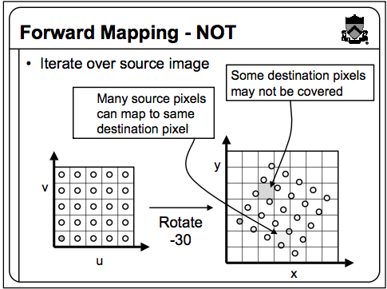
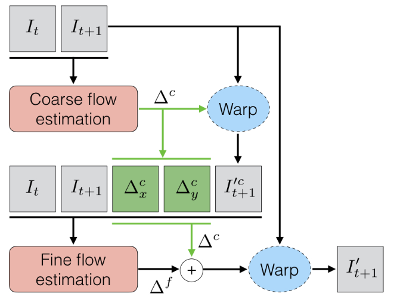

论文地址：

项目地址:

TensorFlow(官方): [jiangsutx/SPMC_VideoSR](https://github.com/jiangsutx/SPMC_VideoSR)
PyTorch: [nameless-Chatoyant/SPMC_VideoSR-pytorch](https://github.com/nameless-Chatoyant/SPMC_VideoSR-pytorch)
Tensorpack: [JesseYang/VideoSR](https://github.com/JesseYang/VideoSR)

## 相关论文

ESPCN([Real-Time Single Image and Video Super-Resolution Using an Efficient Sub-Pixel Convolutional Neural Network](https://arxiv.org/abs/1609.05158))

VESPCN([Real-Time Video Super-Resolution with Spatio-Temporal Networks and Motion Compensation](https://arxiv.org/abs/1611.05250))

本篇SPMC VideoSR([LINK]())

# 概述
[Super Resolution]()

参考帧(reference frames)的利用

在训练阶段，如果以end-to-end的方式训练整个网络（随机初始化）会导致运动估计的zero flow，从而使得最终结果近似于single-image SR
$F_i\rightarrow 0$

会做一次resize

源图像a
目标图像b
$F_a\rightarrow b$
warping分两种forward warping和backward warping
forward warping 源图像到目标图像
backward warping 目标图像到源图像

Motion Estimation(ME) Module得optical flow
SPMC layer根据optical flow warp原图并resize
Detail Fusion Net从多张LR的大图中还原细节得到HR的结果
# 前置技能点
- Super Resolution综述
- Forward Warp和Backward Warp
# 模型
## Backward Warping与Forward Warping
第一部分并不讲网络中的模块，而是模块当中会用到的两种warping方法。按字面意思，在已知F_a->b的前提下，Backward Warping是由b求a，Forward Warping是由a求b.

推荐阅读这个PDF的对应部分，图示很清晰地展示了两种方法的优缺点。https://www.cs.princeton.edu/courses/archive/fall00/cs426/lectures/warp/warp.pdf

接下来是两种算法的详解。

### Forward Warping

用代码来表示Forward Warping的思路

```c
for (int u = 0; u < umax; u++) {
	for (int v = 0; v < vmax; v++) {
		float x = fx(u,v);
		float y = fy(u,v);
		dst(x,y) = src(u,v);
	}
}
```

遍历原图的每个坐标，求得新坐标$Coord_{dst}$，在目标图的$Coord_{dst}$位置放置原图的像素。$Coord_{dst}$很有可能不是整数，目标图中有些坐标没有映射或有多个映射。所以在做完所有像素的映射后，还需要进行interpolation通过计算把非整数的坐标的值赋给整数坐标位置。

```c
for (int u = 0; u < umax; u++) {
	for (int v = 0; v < vmax; v++) {
		float x = fx(u,v);
		float y = fy(u,v);
        
		dst(x_upper_left,y_upper_right) = F(src(u,v), diff_upper_left);
        dst(x_upper_left,y_upper_right) = F(src(u,v), diff_upper_right);
        dst(x_upper_left,y_upper_right) = F(src(u,v), diff_);
        dst(x_upper_left,y_upper_right) = F(src(u,v), );
	}
}
```



TensorFlow向量化的做法：`tf.scatter`的功能是根据`indices`将`params`放置到指定`shape`中。考虑到会有多个映射的情况以及打包成batch的数据，应用`tf.scatter_nd_add`([tf.scatter_nd_add  |  TensorFlow](https://www.tensorflow.org/api_docs/python/tf/scatter_nd_add))。

### Backward Warping

```c
for (int x = 0; x < xmax; x++) {
	for (int y = 0; y < ymax; y++) {
		float u = fx_1(x,y);
		float v = fy_1(x,y);
		dst(x,y) = resample_src(u,v,w);
	}
}
```

遍历目标图的每个坐标，通过$F^{-1}$求得原图的坐标$Coord_{src}$，因为这个坐标很有可能不是整数，所以需要通过`resample_src()`来得到一个像素值放到目标图的对应坐标处，往往是把$Coord_{src}$周围四个整数坐标的像素值根据到$Coord_{src}$的距离加权求和。

TensorFlow向量化的做法：`tf.gather`的功能是根据`indices`从`params`中取出对应的元素。替换上述循环算法的取值过程，当然需要先算出`indices`，对于打包成batch的数据，应使用`tf.gather_nd`([tf.gather_nd  |  TensorFlow](https://www.tensorflow.org/api_docs/python/tf/gather_nd))。


## Motion Estimation
ME模块继续沿用了[VESPCN]()的STN结构，
$$F_{i\rightarrow j} = Net_{ME} (I^L_i, I^L_j;\theta_{ME})$$

两张图$I_t$和$I_{t+1}$叠加成(1, H, W, 2)的Tensor作为网络的输入，经过Coarse flow estimation后得到(1, H, W, 2)的$\Delta^c$, $I_{t+1}$与$\Delta^c$做back warping得到对齐后的$I_{t+1}$
$I_t$, $I_{t+1}$, $\Delta^c_x$, $\Delta^c_y$, $I_{t+1}$叠加成(1, H, W, 5)的Tensor，经过Fine flow estimation得到$\Delta^f$, $\Delta^f$和$\Delta^c$做加法，$I_{i+1}$与$\Delta$做backward warping，得$I'_{t+1}$，可通过肉眼判断l

$I_i = BackwardWarping(F_{i\rightarrow j}, I_j)$

其中的warp, 是给定$F_{i\rightarrow j}$和$I_j$，得$I_i$，即backward warping
是可选的，既可以得到F_i\rightarrow j也可以得到F_j\rightarrow i

sub-pixel upscale

将`(H, W, 32)`的feature map压缩到`(H*4, W*4, 2)`

原论文中的loss
改进loss:$$L_{ME} = \Sigma^T_{i=-T}\parallel I^L_i - I^L_{0\rightarrow i}\parallel _1 + \lambda_1 \parallel \nabla F_{i\rightarrow 0}\parallel _1$$


## SPMC Layer
SPMC的全称为sub-pixel motion compensation，顾名思义这一模块完成了运动补偿(motion compensation)和尺寸放大(sub-pixel scaling)两个任务。
$$J^H=Layer_{SPMC}(J^L,F;\alpha)$$

分为两个模块Sampling Grid Generator和Differentiable Image Sampler
### Sampling Grid Generator
经过第一步Motion Estimation模块，我们由两张LR的图I_i和I_0得到了flow vectors I_i到I_0的

$$(x^s_p) = W_{F;\alpha}(x_p) = \alpha (x_p)$$

从$I_i$可以得到一个元素为原坐标的矩阵(shape = (H, W, 2))，将$F_{i\rightarrow 0}$加到上面，得到了经过偏移的坐标矩阵(shape = (H, W, 2))，其中的元素值变为了原坐标经过运动补偿应该在的坐标，再经过upscale得到最终结果，原坐标经过运动补偿应该在的坐标(shape = (H', W', 2))

$\alpha$是scale factor，是根据实际需求已经预设好的。

### Differentiable Image Sampler
在上一个SPMC子模块我们得到了坐标矩阵(shape = (H', W', 2))，描述了每个点经过运动补偿和放大后的坐标值。而这一模块就要利用这些坐标进行warping，这里我们已知$I_i$上每个点经过变换后的新坐标，由$I_i$去生成变换后的$I'_i$，所以是Forward Warping。

$$J^H_q = \Sigma_{p = 1}J^L_pM(x^s_p-x_q)M(y^s_p-y_q)$$

使用Forward Warping的方式，整合了Backward Warping + Interpolation的多步变换。

## Detail Fusion Net
$$L_(SR) = \Sigma^T_{i=-T}k_i\parallel I^H_0 - I^{(i)}_0\parallel ^2_2$$

分为三个模块Encoder, ConvLSTM, Decoder

经过SPMC层后，我们得到一张HR尺寸的图，但是由于Forward Warping+upsampling这张图是稀疏的（论文中也举例长宽扩大4倍的话，大约15/16的像素值为0）。接下来我们就要通过不同帧提供的稀疏矩阵来生成一张细节丰富的图。

使用Interpolation来填补这些0值不好的原因是插的值在训练过程会主导。

Encoder压缩了原本稀疏的feature map

$$f_i = Net_E(J^H_i;\theta_E)$$

$$g_i,s_i = ConvLSTM(f_i,s_{i-1};\theta_{LSTM})$$

$$I^{(i)}_0 = Net_D(g_i, S^E_i;\theta_D) + I^{L\uparrow}_0$$

# 模型训练

1. 训练ME

   只用$L_{ME}$，$\lambda_1 = 0.01$，70,000 iterations

2. 训练Detail Fusion Net

   冻结$\theta_{ME}$，20,000 iterations

3. 整体训练，


# 坑
一般做了，即把值为0~1的图转为-0.5~0.5的范围

# warp
warpping过程会有无映射的坐标需要填值，不管填什么值都会对loss有影响，最好还是计算warp loss时用mask把这部分像素滤掉
以
上移的程度还不够，填补带来的loss和真loss就平衡了，导致MotionEstimation收敛在较高的loss

1. 像素范围(-0.5, 0.5)，空映射填0，正常计算warp loss
2. 像素范围(0, 1.0)，空映射填0，正常计算warp loss
3. 只计算有映射像素的warp loss
第二种情况，空映射对loss的影响会更大，导致在cost还很高的时候就收敛了

同样的loss公式，三种情况的loss： 3 < 1 < 2

用来说明情况1和2的差别
```python
a = np.arange(0.0, 1.0, 1.0/100)
b = np.arange(-0.5, 0.5, 1.0/100)
sum_a = np.sum(np.abs(0 - a)) # 49.50
sum_b = np.sum(np.abs(0 - b)) # 25.00
```