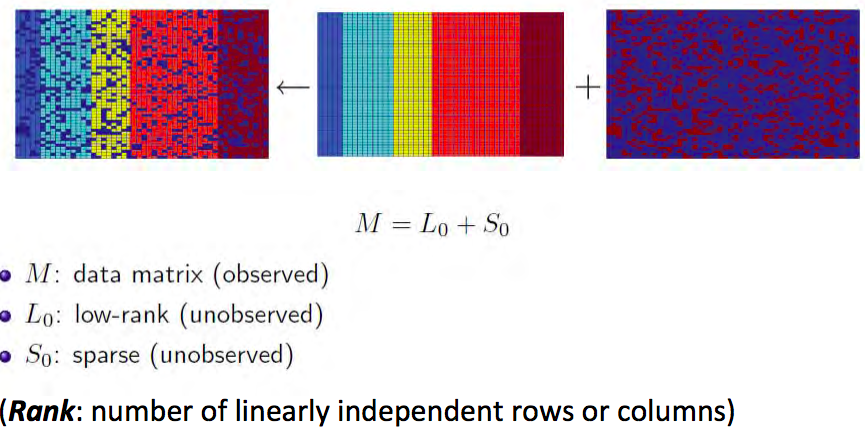
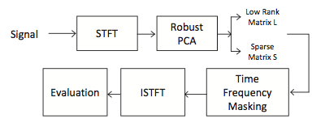
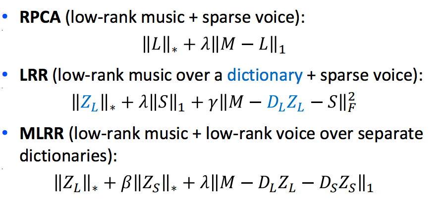
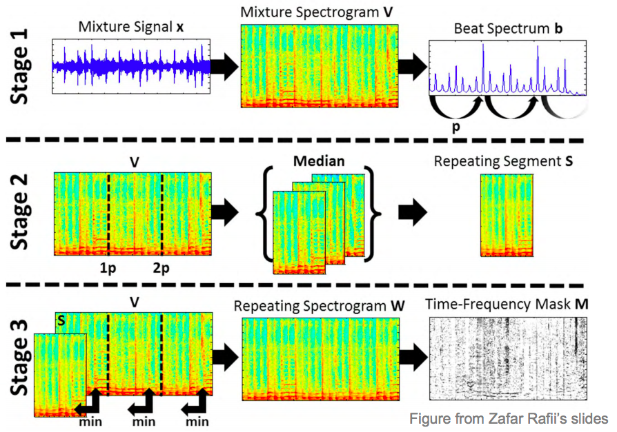
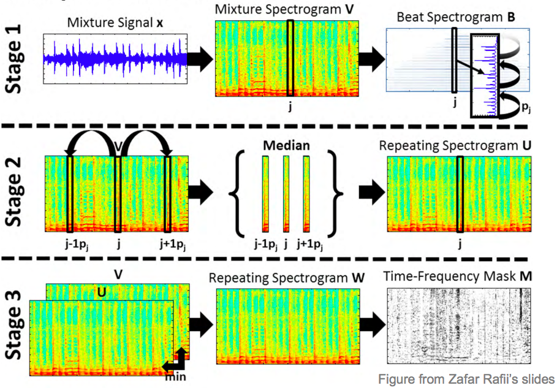
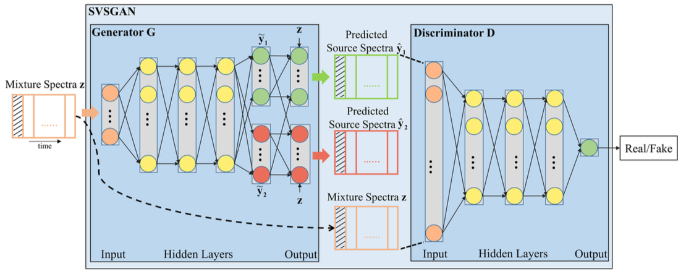
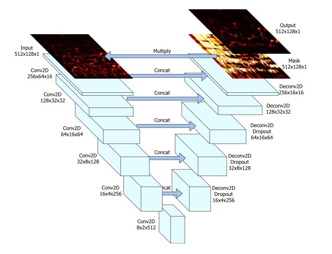
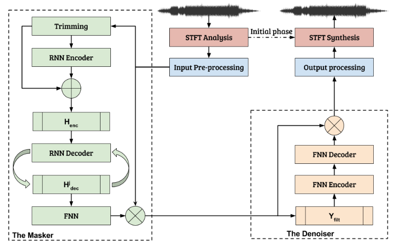

# 目录
---
[概述](#概述)
# 概述
---
Singing Voice Separation, 顾名思义从音乐中分离人声和伴奏。在信号处理学科，属于Blind Source Separation, 即不从信号混合过程获得额外信息，从一组混合后的信号分离出源信号来。一组混合信号到多组源信号，从信息量来说是一个由少到多的过程，所以又与Music Information Retrieval挂钩。

不同于深度学习在视觉领域的火热，Singing Voice Separation的算法都还相当依赖于传统算法，模型复杂效果不尽如人意，留给深度学习的进步空间还很大。

由于扒伴奏已经投入到日常应用当中了，所以不太可能想到这项任务的艰辛。到目前为止还没有效果满意的自动声伴分离应用，原因如下：
- 无中生有。需要生成原先不存在（在混音过程中丢失）的信息。
- 目标不明确。何为人声何为伴奏？举一个最典型的例子，阿卡贝拉的伴奏同样是人声制造的，人声和伴奏之间的差别其实是很难定义的。
- 如果利用有监督学习的方法。数据量小。获取训练数据的成本高。

2017年11月丢到arxiv的[Monaural Singing Voice Separation with Skip-Filtering Connections and Recurrent Inference of Time-Frequency Mask](https://arxiv.org/abs/1711.01437)

- 自动校音(automatic pitch correction)
- 自唱评分(singing skill evaluation for Karaoke)
- 哼唱查询(query-by-humming)
- 歌唱合成(singing synthesis)，例如V家

## 相关会议
- ISMIR(International Society for Music Information Retrieval)
- MIREX(Music Information Retrieval Evaluation)
~2013 Melody Extraction (Separation-based Methods)
2014~2016 Singing Voice Separation

## 相关论文
[Deep Karaoke: Extracting Vocals from Musical Mixtures Using a Convolutional Deep Neural Network](https://arxiv.org/abs/1504.04658)
[Singing-Voice Separation From Monaural Recordings Using Deep Recurrent Neural Networks](http://paris.cs.illinois.edu/pubs/huang-ismir2014.pdf)
[Vocal Activity Informed Singing Voice Separation With the iKala Dataset](https://pdfs.semanticscholar.org/cde4/791e5da32f8c26c02f4828943325e8471dc0.pdf)
[Informed Group-Sparse Representation for Singing Voice Separation](http://mac.citi.sinica.edu.tw/ikala/chan17spl.pdf)
[Melody Extraction from Polyphonic Music Signals using Pitch Contour Characteristics](http://mtg.upf.edu/system/files/publications/SalamonGomezMelodyTASLP2012.pdf)
[Monaural Singing Voice Separation with Skip-Filtering Connections and Recurrent Inference of Time-Frequency Mask](https://arxiv.org/abs/1711.01437)

## Scoring Metrics
作为一项生成任务，以下是MIREX等会议使用过的。

越高越好
GNSDR = Global Normalized Signal-to-Distortion Ratio 
NSDR = Normalized Signal-to-Distortion Ratio 
SIR = Signal-to-Interference Ratio
SAR = Signal-to-Artifacts Ratio

## 数据集
[iKala](http://mac.citi.sinica.edu.tw/ikala/)
[MIR-1K](https://sites.google.com/site/unvoicedsoundseparation/mir-1k)
# 方法
---

IdBM(Ideal Binary Mask)
Masking-based: learn to predict the ideal binary or soft mask
Mapping-based: learn a regression function from a mixed signal to clean source signals directly
基于低秩(low-rank based)：
基于蒙版(Masking-based)：预测一个IdBM或IdSM
基于映射(Mapping-based)：从混合信号学习一个回归函数来清理出源信号
## 基于低秩(low-rank based)
基于低秩方法指的是，假设音乐中伴奏是低秩的而人声是离散的，从而提出的基于前／背景分离模型。

[Singing-Voice Separation from Monaural Recordings using Robust Principal Component Analysis](http://citeseerx.ist.psu.edu/viewdoc/download?doi=10.1.1.294.6722&rep=rep1&type=pdf)
中提出了第一个完整的离散声音(前景)+低秩音乐(背景)的模型

### PCA(Principal Component Analysis)
主成分分析法
### RPCA(Robust Principal Component Analysis)

缺点：
- 无监督
- 假设太强，比如鼓点就是离散的
- 没有考虑音调、结构等信息
[Low-rank Representation of both Singing Voice and Music Accompaniment via Learned Dictionaries](http://www.ppgia.pucpr.br/ismir2013/wp-content/uploads/2013/09/17_Paper.pdf)提出了多种低秩表示
RPCA(low-rank music + sparse voice)
$$$$
LRR(low-rank music over a dictionary + sparse voice)
$$$$
MLRR(low-rank music + low-rank voice over separate dictionaries)
$$$$

## REPET(REpeat Pattern Extraction Technique)
假设存在阶段性重复的模式(periodically repeating patterns)
识别重复元素，得到重复模型，抽取重复模式

假设的错误：
这些重复也有可能是间断的，或者without a global (or local) period
## 短时傅里叶变换(STFT, short-term Fourier transform)
## 基于蒙版(masking-based)

## 基于映射(mapping-based)
## 开始引入深度学习
ISMIR 2014上，[Singing-Voice Separation From Monaural Recordings Using Deep Recurrent Neural Networks](http://paris.cs.illinois.edu/pubs/huang-ismir2014.pdf)

[Singing Voice Separation and Vocal F0 Estimation based on Mutual Combination of Robust Principal Component Analysis and Subharmonic Summation](https://arxiv.org/abs/1604.00192)

[A Deep Ensemble Learning Method for Monaural Speech Separation](http://www.xiaolei-zhang.net/papers/Zhang,%20Wang%20-%202016%20-%20A%20Deep%20Ensemble%20Learning%20Method%20for%20Monaural%20Speech%20Separation.pdf)

### SVSGAN
[SVSGAN: Singing Voice Separation via Generative Adversarial Network](https://arxiv.org/abs/1710.11428)

使用CGAN
### U-Net
[Singing Voice Separation with Deep U-Net Convolutional Networks](https://ismir2017.smcnus.org/wp-content/uploads/2017/10/171_Paper.pdf)

U-Net架构: 
作为比较先进的尝试，性能上GAN架构目前是落后U-Net架构的。引入了在CV界成功的模型从而摒弃了之前繁复的计算，具有探索价值。
### Skip-Filtering
[Monaural Singing Voice Separation with Skip-Filtering Connections and Recurrent Inference of Time-Frequency Mask](https://arxiv.org/abs/1711.01437)

# 总结
2012年，第一次引入
2017年，基于GAN和U-Net的模型出现，开始摒弃之前繁复的计算。

# 附录
## 各方法demo

SVSGAN |[在线](http://mirlab.org:8080/demo/SVSGAN/)
[静态](http://mirlab.org:8080/demo/SVSGAN/svsgan_paper_result.html)

U-Net [静态](http://mirg.city.ac.uk/codeapps/vocal-source-separation-ismir2017)
## 参考资料
[音樂資訊檢索](http://mac.citi.sinica.edu.tw/~yang/teaching/lecture11_separation.pdf): 中央研究所的slides
[陈德成](https://www.citi.sinica.edu.tw/pages/takshingchan/index_zh.html)博士(Tak-Shing T. Chan)